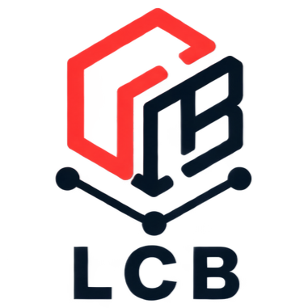

<p align="center">
  
</p>

<h1 align="center">Laravel Cloud Blueprint</h1>

<p align="center">Declarative infrastructure for Laravel Cloud.</p>

<p align="center"><code>YAML → PLAN → APPLY</code></p>

Laravel Cloud Blueprint is an unofficial community CLI for describing a supported subset of Laravel Cloud resources in version-controlled YAML blueprints. It produces a read-only plan before mutation, then reconciles supported application, environment, and environment-variable changes when you apply it.

> [!WARNING]
> Version `0.1.0-alpha.6` is early alpha software with a deliberately limited mutation model. This is an unofficial community project and is not affiliated with or maintained by Laravel.

## See the Plan Before You Apply

```text
$ lcb plan
Laravel Cloud Blueprint Plan

~ environment.production
  branch: develop → main

~ variable.production.APP_ENV
  Environment variable differs from desired state.

Plan: 0 to create, 2 to update, 0 unchanged, 0 unsupported.
```

Planning is read-only. Applying a supported plan brings the currently supported subset of Laravel Cloud resources toward the desired blueprint without deleting extra remote resources.

## Installation

Install the current alpha release globally through Composer:

```shell
composer global require laravel-cloud-blueprint/cli:^0.1@alpha
lcb --version
```

Expected output:

```text
Laravel Cloud Blueprint 0.1.0-alpha.6
```

Composer's global bin directory must be available in `PATH` for the `lcb` command to be found.

## Status

Current version: `0.1.0-alpha.6`.

Alpha.6 can discover and compare applications, environments, environment variables, Database Clusters, and logical Databases. It can create missing resources in that supported set, update an environment's branch or an existing variable's value, safely delete eligible State-owned Environments removed from the Blueprint, explicitly adopt identity-bearing resources into local State V1, and explicitly release local ownership without touching Laravel Cloud. Application repository and region changes, renames, automatic adoption, remote state, and all Database update, attachment, replacement, and deletion lifecycles remain unsupported.

| Database capability | Status |
| --- | --- |
| Blueprint definitions | Supported |
| Cloud discovery and planning | Supported |
| Import and state ownership | Supported |
| Database Cluster CREATE | Supported |
| Logical Database CREATE | Supported |
| Environment attachment | Unsupported |
| Database UPDATE or replacement | Unsupported |
| Database DELETE or destroy | Unsupported |

### Upgrading from alpha.5

State remains at schema V1, so no migration is required and existing alpha.5 blueprints and State files remain valid. Alpha.6 adds the explicit inverse ownership transition: `lcb import` adopts a matching unmanaged identity, while `lcb state:unmanage <address>` releases a managed identity locally. Ownership release never deletes or modifies the Laravel Cloud resource, and parents with owned children must be handled child-first. Only guarded Environment deletion is supported; Environment Database attachment and all other Cloud deletion remain unsupported.

## Requirements

- PHP 8.3 or newer
- Composer
- A Laravel Cloud API token for Cloud reads and mutations
- A GitHub, GitLab, or Bitbucket repository connected to Laravel Cloud

## Authentication

Set your Laravel Cloud API token in the process environment:

```shell
export LCB_TOKEN="your-token"
```

Never commit API tokens or place them in blueprint files.

## Quick Start: New Infrastructure

```shell
lcb init
lcb validate
lcb plan
lcb apply
```

`apply` displays a fresh plan and asks for confirmation, defaulting to no. Use `--auto-approve` for automation. `--non-interactive` explicitly disables prompting and refuses changes unless combined with `--auto-approve`; JSON apply output likewise requires `--auto-approve` when changes are present.

## Quick Start: Existing Laravel Cloud Application

```shell
lcb init --from-cloud
lcb import
```

If Laravel Cloud does not return source-provider metadata, provide it explicitly:

```shell
lcb init --from-cloud --provider=github
```

`init --from-cloud` performs read-only Cloud discovery and exports supported application and environment structure only. It does not create `.lcb/state.json`, adopt state ownership, export environment-variable values or secrets, or persist remote IDs. The separate `lcb import` command can explicitly adopt matching Application, Environment, Database Cluster, and logical Database identities after review. The init command refuses to overwrite an existing file unless `--force` is supplied; review generated output before importing or applying it.

## Blueprint Example

```yaml
version: 1

organization: my-organization

application:
  name: my-api
  region: eu-central-1
  source:
    provider: github
    repository: acme/my-api

environments:
  production:
    branch: main
    variables:
      APP_ENV:
        value: production

      APP_KEY:
        from_env: APP_KEY
        sensitive: true

database_clusters:
  primary:
    type: neon_serverless_postgres_18
    region: eu-central-1
    config:
      cu_min: 0.25
      cu_max: 1
      suspend_seconds: 300
      retention_days: 7
    databases:
      application: {}
```

`value` supplies a literal string. `from_env` resolves a value from the local process environment when needed for reconciliation, including the fresh plan performed by apply. `sensitive: true` marks intent but does not weaken or strengthen output redaction; it does not create or use a Laravel Cloud Secrets Manager secret.

See [examples/cloud.blueprint.yaml](examples/cloud.blueprint.yaml) for a complete safe example.

## Commands

### `init`

Creates a starter blueprint. `--file=<path>` selects the output path and `--force` permits overwrite.

`--from-cloud` generates a blueprint through read-only Cloud requests. With multiple applications, select interactively or use an exact `--application=<name-or-slug>`. `--non-interactive` refuses ambiguous selection. `--provider=github|gitlab|bitbucket` supplies provider metadata when the API omits it.

### `validate`

Validates the current v1 schema locally. Use `--file=<path>` for a non-default blueprint.

### `cloud:inspect`

Reads the authenticated organization, applications, and environments without mutation. Supports `--json`.

### `plan`

Creates a read-only comparison against Laravel Cloud. Supports `--file=<path>` and `--json`.

### `apply`

Applies supported creates, updates, and guarded Environment deletions after producing a fresh plan. Supports `--file=<path>`, `--auto-approve`, `--non-interactive`, and `--json`.

### `import`

Adopts existing Application, Environment, Database Cluster, and logical Database identities into local LCB state without modifying Laravel Cloud resources. Supports `--file=<path>`, `--auto-approve`, `--non-interactive`, and `--json`.

Import requires explicit confirmation unless `--auto-approve` is supplied. Any conflict or unsupported candidate blocks the entire import. Database Clusters are matched by exact name, type, and region; mutable configuration is deliberately not an import-compatibility gate. Logical Databases are matched by exact name within their resolved parent Cluster. Parent resources are proposed before children, and a parent failure blocks its children. Environment variables, Database attachments, credentials, and connection data are never imported into state. Import performs fresh Cloud discovery after acquiring the state lock so that stale preview identities are not persisted. The lock protects local state writers only; it does not lock or freeze Laravel Cloud resources.

### `state:unmanage`

Releases local LCB ownership of one exact State address. Supported address types are `application`, `environment`, `database_cluster`, and `database`; examples include `environment.production` and `database.primary.application`. It never calls Laravel Cloud and does not require `LCB_TOKEN`. The command previews the change and defaults to no; use `--auto-approve` for automation, with optional `--non-interactive` or `--json`.

Ownership release is deliberately non-recursive. An Application or Database Cluster cannot be unmanaged while it has owned children; release those children explicitly first. Missing addresses are successful no-ops. If the resource remains in the blueprint, the next plan uses normal unmanaged discovery semantics; depending on Cloud reality, that can mean an unmanaged match or a supported CREATE. This command does not determine whether the remote resource exists. An existing resource can later follow the normal explicit `lcb import` workflow. This command is not delete, destroy, detach, or Cloud mutation.

Run `lcb <command> --help` for exact usage.

## Plan Semantics

- `CREATE`: a supported desired resource is missing remotely.
- `UPDATE`: a supported mutable field differs remotely (environment branch or variable value).
- `DELETE`: a State-owned resource is absent from the blueprint. Environment DELETE alone may execute under the guarded lifecycle below; other resource types remain non-executable.
- `NO_CHANGE`: the remote resource matches the blueprint.
- `UNSUPPORTED`: satisfying the difference would require behavior unavailable in this release.

Text plans use `+` for create, `~` for update, `-` for delete intent, `=` for no change, and `!` for unsupported. When present, DELETE counts are included in text and JSON summaries.

Planning is read-only and deterministic. State-owned resources absent from the Blueprint are represented child-first as DELETE intent using their exact stored identities; unmanaged same-name resources never become deletion targets. Environment DELETE intent includes conservative live discovery of attached databases, caches, WebSockets, domains, instances, deployments, secrets, filesystems, and default-environment status. Instances are reported as expected Environment children and do not by themselves block deletion; all other discovered categories remain blockers. Missing, malformed, or unknown relationship data is never treated as safe. Only complete, SAFE Environment DELETE actions can reach guarded apply execution.

Planning loads local state and treats stored Application, Environment, Database Cluster, and logical Database remote IDs as authoritative ownership. A missing managed identity or same-name replacement is never automatically recreated, adopted, or substituted for an owned deletion identity. Exact-name resources without state ownership may still be inspected read-only; existing unmanaged resources must be explicitly adopted with `lcb import` before LCB can mutate them or create owned children. Genuinely absent Database Clusters and logical Databases under new or already-owned Clusters are eligible for `CREATE`. Database configuration differences remain unsupported.

Removing a managed Environment from the blueprint produces a DELETE plan. Apply may delete only the exact State-owned remote Environment when dependency discovery is complete and SAFE, the operator explicitly approves, and locked rediscovery confirms the same identity and parent. There is no force or recursive destroy mode. State ownership is removed only after authoritative remote absence; an already-absent exact ID is reconciled without touching any same-name replacement. Application, Database Cluster, and logical Database DELETE remain non-executable. `lcb state:unmanage` remains a separate local-only ownership operation.

Environment variables remain desired-only and are not recorded as owned state resources. Removing a variable key from the blueprint therefore produces no removal action and leaves the remote variable untouched.

## Apply Semantics

Apply always creates a fresh plan and refuses unsupported actions before Cloud mutation. Supported changes request approval unless auto-approved; interactive approval defaults to no, and `--json` or non-interactive mode does not imply approval. Environment DELETE shows a permanent-deletion warning, then reloads State and Blueprint under lock and performs fresh exact-ID dependency discovery. DELETE is transmitted at most once and a 204 or error never removes State without subsequent authoritative absence. Database CREATE plans retain their locked revalidation. Potentially duplicate-creating POST requests are never automatically retried.

Supported work is processed in dependency order: application, environments, Database Clusters, logical Databases, then environment-variable groups. Environment branch updates use Laravel Cloud's environment PATCH endpoint and accept a confirmed success response without requiring an `attributes.branch` string. Variables are sent per environment with Laravel Cloud's `method=set` mode for both create and update.

Database Cluster and logical Database creation use typed provider-specific requests. Each confirmed remote identity is checkpointed immediately before dependent work continues. Cluster readiness uses bounded, deterministic GET-only observation; neither Cluster nor logical Database POST requests are automatically retried. An uncertain POST outcome or failed state checkpoint stops dependent creation and directs the operator to inspect Laravel Cloud and use explicit import. Database connection and credential fields are discarded at the HTTP parsing boundary.

The safe Database workflow is: define a Cluster and its logical Databases, validate, review the read-only plan, apply, checkpoint each confirmed identity, then verify that the next plan is `NO_CHANGE`. An exact remote match without local ownership remains read-only until explicitly adopted with `lcb import`.

Environment Database attachment remains unsupported. Because `UNSUPPORTED` retains its global apply-blocking meaning, a desired attachment prevents the same plan from creating its Database resources. Temporarily omit the Environment `database` reference, create and checkpoint the Database resources, then restore the reference for read-only visibility until attachment support is implemented. No Environment Database PATCH or injected-variable handling occurs in this release.

Database Cluster and logical Database creation were verified in a controlled real Laravel Cloud E2E using `neon_serverless_postgres_18` with a Dev-sized configuration. Both identities were checkpointed, the post-create plan reconciled to `NO_CHANGE`, and repeat apply returned `No changes` without rewriting state. No credential material appeared in visible output or state. Environment attachment was neither tested nor enabled, and the CLI output did not expose the internal readiness status sequence or raw create HTTP status.

Successful application and environment creations are checkpointed as work progresses. Environment branch updates retain their remote identity and do not cause a state save or serial increment solely because of the update. Variables remain outside state, so variable updates likewise do not save or increment state. A pure supported UPDATE apply leaves `.lcb/state.json` unchanged; a mixed CREATE + UPDATE apply can change it when a successful CREATE identity is checkpointed. A later failure is reported as partial, with completed checkpoints retained, and confirmed remote mutations are not rolled back.

## State

Local state is stored in `.lcb/state.json`. It contains remote IDs for LCB-managed Application, Environment, Database Cluster, and logical Database resources. Variables and Database attachments are not state resources, and secret values are never stored.

State uses local locking and atomic replacement and should not be edited manually. `init --from-cloud` neither creates state nor adopts remote resources into existing state.

Managed Application and Environment addresses are resolved by their stored remote IDs. Planning validates their expected type, Environment parent address, and conflicting reuse of a remote ID. State ownership is not silently reassigned when Cloud contains another resource with the same name.

`lcb import` is the only explicit state-adoption workflow. It atomically records matching Application, Environment, Database Cluster, and logical Database identities using state schema v1. Cluster and logical Database identities are state-owned; Database attachments remain derived read-only relationships and are never persisted. Import does not adopt variables, repair conflicts, or modify remote configuration. Normal plan and apply matching never adopt unmanaged resources implicitly.

`lcb state:unmanage <address>` is the explicit inverse ownership operation. It atomically removes only the selected local identity, preserves State V1 and its normal serial progression, makes no Cloud request, and refuses parents with owned children. It never recursively removes ownership or deletes the remote resource.

## Security

- API tokens are never written to blueprints or state.
- Environment-variable values are not printed in plans or apply results and are not persisted in state.
- Use `from_env` for secret material.
- Blueprint `value` fields are literal and version-controlled; do not place secrets in them.
- `sensitive: true` is LCB redaction metadata, not Laravel Cloud Secrets Manager integration.

See [SECURITY.md](SECURITY.md) for vulnerability reporting guidance.

## Known Limitations

- This is early alpha software with a limited mutation model.
- Blueprint schema v1 accepts typed `database_clusters` declarations and Environment `database` references. Discovery, planning, explicit import, Database Cluster CREATE, and logical Database CREATE are supported. Existing resources require import before owned mutation. Database configuration UPDATE, Environment Database attachment/detach, and Database DELETE/destroy remain unsupported.
- Environment branch and variable value updates are supported; other updates and renames are not. A variable-key change is not an in-place rename and cannot remove the old remote key.
- Application repository changes are explicitly unsupported because changing a repository can affect existing environment branch relationships in Laravel Cloud, requiring a broader lifecycle/rebinding workflow than this release implements. No repository mutation request is sent.
- Application region changes are unsupported.
- Explicit Application, Environment, Database Cluster, and logical Database identity adoption is supported through `lcb import`; variable and Database attachment adoption, automatic adoption, conflict repair, and repository migration or rebinding are not supported.
- Managed resources removed from the blueprint produce DELETE plans. Only eligible Environment actions may execute; other resource types remain in State unless ownership is explicitly released with `lcb state:unmanage`. Rename/state-move semantics are not supported.
- Removed environment-variable keys are not reported because variables do not yet have state ownership; remote variables remain untouched.
- DELETE execution for Application and Database resources, destroy commands, force bypasses, drift repair, and remote state are not supported.
- Database configuration mutation, Database attachment ownership/mutation, caches, storage, domains, and Secrets Manager are not supported.
- `init --from-cloud` does not export environment variables or secrets.
- Source-provider metadata may be absent from API responses and require `--provider`.
- Environment-variable mutation uses Laravel Cloud's `method=set` request mode for both creates and updates.
- A variable missing during plan could be created externally before apply; because Cloud provides `set` rather than conditional create, apply could then update that key.
- Variable values are omitted or redacted from text and JSON plan/apply output, state, and safe exceptions regardless of whether `sensitive: true` is set; Cloud validation and transport errors are sanitized before display.
- Laravel Cloud API behavior may evolve during the alpha lifecycle.

## Roadmap

- Database attachment and configuration updates; attachment work must define safe handling for automatically injected resource variables before enabling PATCH
- Cache resources
- Richer planning and update semantics
- Broader import workflows and conflict repair
- Destroy and drift detection
- Distribution improvements

No release dates are promised for roadmap items.

## Development

```shell
git clone https://github.com/eroltukenmez/laravel-cloud-blueprint.git
cd laravel-cloud-blueprint
composer install
composer test
composer analyse
```

From a repository checkout, invoke the CLI as `php bin/lcb`. PHPStan runs at maximum level. Tests use fakes and do not require a live Laravel Cloud account.

## Contributing

See [CONTRIBUTING.md](CONTRIBUTING.md).

## License

Laravel Cloud Blueprint is released under the [MIT License](LICENSE).
